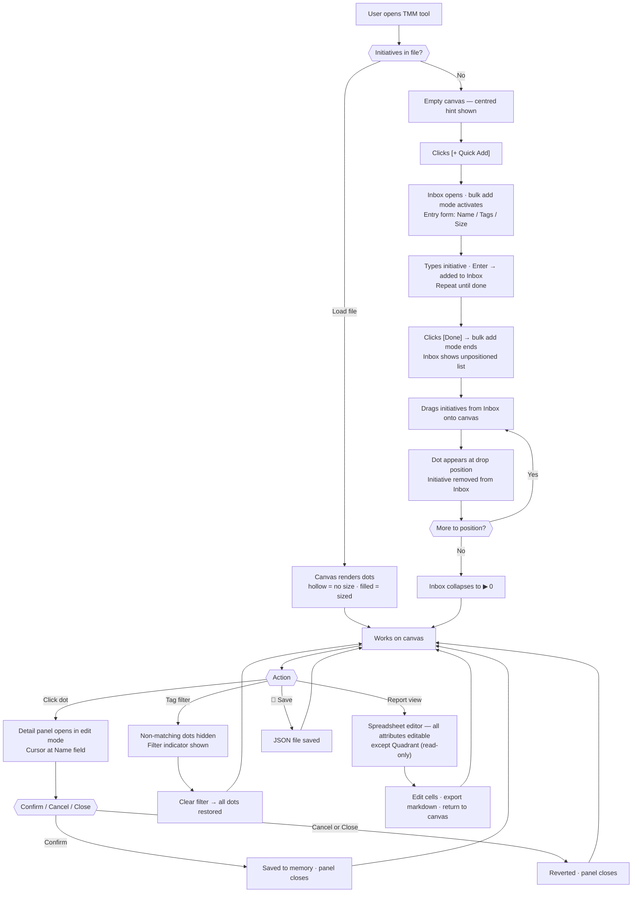

# UX Specification — TMM Tool (001-tmm fixes + 002-tmm-tags-size-report)

_Produced by /dmux on 2026-05-08._
_Retroactive context: to be read by Copilot alongside spec.md when
running /speckit.plan for the 002-tmm-tags-size-report branch._

This spec covers two layers:
- **Layer A**: UX fixes to the existing 001-tmm implementation
  (UC1–UC4 identified in PO review)
- **Layer B**: UX design for new 002-tmm-tags-size-report features
  (Tags, T-shirt Sizing, Report view, Inbox)

Both layers are implemented in branch `002-tmm-tags-size-report`.

---

## User Journey



---

## Screens

### Screen 1 — Canvas View

**When shown:** Always — the main screen of the tool.
**Purpose:** Position and review initiatives on the 4-quadrant matrix.

```
┌────────────────────────────────────────────────────────────────-------------──────┐
│  TMM      [+ Quick Add]  [📊 Report]  [💾 Save]  [📂 Load]                         │
│  ← Back to Toolkit    Filter: [ (all tags) ▼ ]                                    │
├──────────────────────────────────────────────────────────────-------------────────┤
│  ⚠ Changes not saved — click 💾 Save to preserve your edits                       │  ← red, hidden when clean
├──────┬─────────────────────────────────────────-------------──┬───────────────────┤
│[▶ 0] │  More Impact                                           │                   │
│      │               ┌──────────────────┬──────────────────┐  │ (detail panel     │
│      │               │ Q1 Firefighting  │ Q2 Growth        │  │  appears here     │
│      │               │       ●          │        ○         │  │  when dot         │
│      │               ├──────────────────┼──────────────────┤  │  is clicked —     │
│      │               │ Q3 Distraction   │ Q4 Waste         │  │  see Screen 2)    │
│      │               │                  │                  │  │                   │
│      │               └──────────────────┴──────────────────┘  │                   │
│      │  Less Impact                                           │                   │
│      │                   More Urgent        Less Urgent       │                   │
└──────┴───────────────────────────────-------------────────────┴───────────────────┘
● = filled dot (size set)    ○ = hollow dot (size not yet set)
```

**Empty state (no initiatives):**
```
├──────┬───────────────────────────────────────────────────────────────┤
│[▶ 0] │  ┌──────────────────┬──────────────────┐                     │
│      │  │ Q1 Firefighting  │ Q2 Growth        │                     │
│      │  │                  │                  │                     │
│      │  ├──── 📂 Load a matrix ───────────────────────────────────── │
│      │  │       or click [+ Quick Add] to get started                │
│      │  ├──────────────────┼──────────────────┤                     │
│      │  │ Q3 Distraction   │ Q4 Waste         │                     │
│      │  └──────────────────┴──────────────────┘                     │
└──────┴───────────────────────────────────────────────────────────────┘
```

**Tag filter — active state:**
```
│  Filter: [ #health ▼ ]  [× Clear]                                    │
```

**Key interactions:**
- [+ Quick Add] opens Inbox and activates bulk add mode
- Drag from Inbox onto canvas to position an initiative
- Click dot → opens detail panel (Screen 2)
- Filter dropdown populated from tags present on current canvas
- [📊 Report] switches to Report view (Screen 3)

**Data shown:**
- Dot position: derived from initiative x/y coordinates
- Dot diameter: derived from initiative size (XS/S/M/L/XL)
- Dot fill: filled = size set; hollow outlined circle = size null
- Dot label: initiative name (truncated with ellipsis at 30 chars)

---

### Screen 1a — Inbox Panel (state of Canvas View)

**When shown:** When [+ Quick Add] is clicked, or manually expanded.
**Purpose:** Brain dump — enter all initiatives before positioning on canvas.

**Bulk add mode active:**
```
├──────────────────────┬───────────────────────────────────────────────┤
│  INBOX (2)  [Done]   │                                               │
├──────────────────────┤                                               │
│  ⠿ Initiative A [×] │        ... canvas visible to the right ...    │
│  ⠿ Initiative B [×] │                                               │
├──────────────────────┤                                               │
│  [Initiative name  ] │                                               │
│  [Tags             ] │                                               │
│  [Size ▼           ] │                                               │
│                      │                                               │
│  Tab · Enter to add  │                                               │
└──────────────────────┴───────────────────────────────────────────────┘
```

**List mode (after [Done]):**
```
├──────────────────────┤
│  INBOX (2)    [─]    │
├──────────────────────┤
│  ⠿ Initiative A [×] │
│  ⠿ Initiative B [×] │
└──────────────────────┘
```

**Collapsed:**
```
│ [▶ 2] │
```

**Key interactions:**
- Tab moves between Name → Tags → Size; Enter submits row and opens next
- [×] per row removes the initiative immediately with no confirmation
- Drag handle (⠿) allows dragging initiative onto canvas to position it
- [Done] exits bulk add mode, returns to list mode
- [─] collapses panel; [▶ N] expands it

---

### Screen 2 — Detail Panel

**When shown:** When a canvas dot is clicked.
**Purpose:** View and edit all attributes of a positioned initiative.

**Edit mode (default on open):**
```
┌──────────────────────────────┐
│ INITIATIVE          [Close]  │  ← [Close] blocked if changes made
├──────────────────────────────┤
│ NAME *                       │
│ [Health initiative       ]   │  ← cursor here on open
│                              │
│ TAGS                         │
│ [#health #career         ]   │
│ Space-separated, e.g. #work  │
│                              │
│ SIZE                         │
│ [ M ▼                    ]   │
│ XS · S · M · L · XL · none  │
│                              │
│ DETAILS                      │
│ [Some notes here...      ]   │
│ [                        ]   │  ← Enter = new line; Tab = next field
│                              │
│         [Cancel]  [Confirm]  │
└──────────────────────────────┘
```

**Tags field — invalid input:**
```
│ [career                  ]   │
│ ⚠ Use # prefix — e.g. #career│
```

**Delete confirmation dialog:**
```
┌──────────────────────────────┐
│ Delete this initiative?      │
│ This cannot be undone.       │
│                              │
│     [Cancel]  [Yes, delete]  │
└──────────────────────────────┘
```

**Key interactions:**
- Tab order: Name → Tags → Size → Details → Confirm → Name
- [Close]: closes if no changes; visually disabled once any change is made
- Click same dot again: closes if no changes; blocked if changes made
- Click blank canvas space: does NOT close the panel
- [Cancel]: reverts all changes and closes
- [Confirm]: saves changes to in-memory state and closes
- [Delete] (position at Copilot's discretion): triggers confirmation dialog

**Data shown:**
- Name: user input (stored on initiative)
- Tags: array rendered as space-separated tokens (user input)
- Size: single enum value XS/S/M/L/XL/none (user selection)
- Details: free text, multi-line (user input)

---

### Screen 3 — Report View

**When shown:** When [📊 Report] is clicked from the canvas view.
**Purpose:** Review and edit all initiative attributes in a table; export as markdown.

**Normal state:**
```
┌──────────────────────────────────────────────────────────────────────┐
│  TMM — Report               [Export Markdown]   [← Back to Canvas]  │
├──────────────────────────────────────────────────────────────────────┤
│  ⚠ Changes not saved — click 💾 Save to preserve your edits          │  ← red, hidden when clean
├──────┬──────────────────┬───────────────┬──────┬────────────────────┤
│  Q   │ Name             │ Tags          │ Size │ Details            │
├──────┼──────────────────┼───────────────┼──────┼────────────────────┤
│  Q1  │ Initiative A     │ #health       │ L    │ Notes...           │
│  Q2  │ Initiative B     │ #career       │ M    │                    │
│  Q2  │ Initiative C     │ #health #work │      │                    │
│  Q3  │ Initiative D     │               │ S    │ More notes...      │
└──────┴──────────────────┴───────────────┴──────┴────────────────────┘
```

**Cell selected (keyboard navigation):**
```
│  Q2  │[ Initiative B    ]│ #career       │ M    │                    │
```
← highlighted; Enter to edit, Tab/arrows to move

**Cell in edit mode:**
```
│  Q2  │[ Initiative B_   ]│ #career       │ M    │                    │
```
← cursor active; Esc cancels (reverts); Tab/Enter commits and moves

**Tags cell — invalid input:**
```
│  Q2  │ Initiative B      │[ career      ]│ M    │                    │
│      │                   │⚠ Use # prefix │      │                    │
│      │                   │  e.g. #career │      │                    │
```

**Empty state (no initiatives):**
```
├──────┬──────────────────┬───────────────┬──────┬────────────────────┤
│  Q   │ Name             │ Tags          │ Size │ Details            │
├──────┴──────────────────┴───────────────┴──────┴────────────────────┤
│                                                                      │
│         No initiatives yet — go back to the canvas                  │
│              to add your first initiative.                           │
│                                                                      │
└──────────────────────────────────────────────────────────────────────┘
```

**Key interactions:**
- Arrow keys and Tab navigate between cells (Q column skipped — not selectable)
- Enter toggles selected cell into edit mode
- Esc cancels edit and reverts cell to previous value
- Q column: not selectable, not editable
- Name edits do NOT change the initiative's unique ID
- Size cell edit mode opens a dropdown (XS/S/M/L/XL/none)
- Details cell: Enter = new line; Tab = commit and move to next cell
- Changes apply immediately to shared in-memory state
- [← Back to Canvas] returns to canvas view; canvas reflects all edits immediately

**Data shown:**
- Q: derived from x/y position (Q1 = High Impact + High Urgency, etc.) — short label only
- Name: user input
- Tags: space-separated tokens
- Size: enum value or blank if null
- Details: free text (truncated in cell; full value visible in edit mode)

---

## UX Functional Requirements

These requirements MUST be reflected as FRs in spec.md.
Copilot must not omit these — they are not optional enhancements.

| ID | Requirement |
|---|---|
| FR-UX-001 | The Inbox panel MUST default to closed on load. The canvas MUST show a centred hint "Load a matrix or click [+ Quick Add] to get started" when no initiatives exist and the Inbox is closed. |
| FR-UX-002 | [+ Quick Add] MUST open the Inbox and activate bulk add mode in one action. The entry form MUST persist until [Done] is clicked — no repeated button clicks required. |
| FR-UX-003 | The Inbox entry form MUST contain Name (required), Tags (optional), and Size (optional) only. Tab moves between fields; Enter submits the current row and opens a blank row for the next entry. Details is NOT included in the Inbox form. |
| FR-UX-004 | New initiatives created via Quick Add MUST be placed in the Inbox, not directly on the canvas. They appear on the canvas only when dragged from the Inbox and dropped onto a canvas position. |
| FR-UX-005 | Each Inbox row MUST have an [×] delete control that removes the initiative immediately with no confirmation dialog. |
| FR-UX-006 | The Inbox MUST be collapsible. When collapsed it MUST display a count badge showing the number of unpositioned initiatives (e.g. [▶ 3]). Zero unpositioned shows [▶ 0]. |
| FR-UX-007 | Clicking a canvas dot MUST open the detail panel in edit mode immediately, with the cursor placed in the Name field. There is no separate view-only mode. |
| FR-UX-008 | The detail panel MUST replace the Category field with a Tags field and add a Size field (XS/S/M/L/XL/none). |
| FR-UX-009 | The [Close] button on the detail panel MUST be visually distinct and always visible. It MUST close the panel only if no changes have been made since opening. It MUST be visually disabled once any change is made. |
| FR-UX-010 | Clicking the same dot again on the canvas MUST close the detail panel if no changes have been made; it MUST be blocked if changes have been made. Clicking blank canvas space MUST NOT close the panel. |
| FR-UX-011 | [Cancel] in the detail panel MUST revert all changes and close the panel. [Confirm] MUST save changes to the in-memory state and close the panel. |
| FR-UX-012 | Deleting an initiative from the detail panel MUST show a confirmation dialog — "Delete this initiative? [Cancel] [Yes, delete]" — before removing any data. |
| FR-UX-013 | A red unsaved-changes banner — "Changes not saved — click 💾 Save to preserve your edits" — MUST appear at the top of both the canvas view and the Report view whenever in-memory state differs from the last saved JSON file. It MUST disappear immediately after a successful save. |
| FR-UX-014 | The Report view MUST function as a spreadsheet editor: arrow keys and Tab select cells; Enter toggles the selected cell into edit mode; Esc cancels the edit and reverts to the previous value. |
| FR-UX-015 | The Q column in the Report view MUST display short labels (Q1–Q4) and MUST be read-only and non-selectable. Repositioning requires returning to the canvas. |
| FR-UX-016 | Editing an initiative's Name in the Report view or detail panel MUST NOT change its unique ID. The ID is the stable cross-tool identifier for COER and Memory Map integration. |
| FR-UX-017 | Tags validation (space-separated #token format) MUST be enforced in both the detail panel and the Report view Tags cell. An invalid token MUST prevent the cell or form from committing; an inline error MUST be shown — e.g. "Use # prefix — e.g. #health". |
| FR-UX-018 | Five t-shirt sizes (XS–XL) MUST map to five visually distinct filled dot diameters on the canvas, proportional to the canvas quadrant width: XS = 1/16 of a quadrant, XL = 1/2 of a quadrant, S/M/L linearly interpolated between them. Diameters MUST rescale when the canvas is resized. Null/unset size MUST render as a hollow outlined circle at the M-equivalent diameter — same size as M but unfilled. This distinguishes "not yet sized" from "explicitly set to M" without a legend. |
| FR-UX-019 | The tool targets desktop and laptop screens only. No responsive layout or mobile touch-target sizing is required. |
| FR-UX-020 | Dragging an initiative from the Inbox and dropping it onto the canvas MUST place a dot at the drop coordinates, remove the initiative from the Inbox list, and decrement the Inbox count badge. The drop position becomes the initiative's stored x/y coordinates immediately. |
| FR-UX-021 | An initiative with null size MUST render as a hollow outlined circle (border visible, no fill) at the M-equivalent diameter (proportional to canvas quadrant width). An initiative with size explicitly set to M MUST render as a filled dot at the same diameter. The distinction signals "sizing not yet done" at a glance. |

---

## States

### Empty state
**Canvas view:** Centred hint displayed over the canvas — "Load a matrix
or click [+ Quick Add] to get started." Inbox shows [▶ 0]. No dots visible.

**Report view:** Table headers shown; body contains a single message row —
"No initiatives yet — go back to the canvas to add your first initiative."

### Unsaved changes state
Both canvas and Report view show a red banner at the top:
"Changes not saved — click 💾 Save to preserve your edits."
Banner disappears immediately on successful save.

### Error state
**Tags input (detail panel and Report view):** Inline message below the
field or cell — "Use # prefix — e.g. #health". Cell or form refuses to
commit until all tokens are valid.

### Loading state
Not needed — all operations are local and instant.

---

## Interaction Patterns

### Inbox bulk add
Entry form stays open persistently. Tab moves between Name → Tags → Size.
Enter submits the current initiative and immediately opens a blank row for
the next. [Done] exits bulk add mode. New initiatives accumulate in the
Inbox list above the entry form as they are added.

### Detail panel change-aware close
The panel tracks whether any field has changed since it opened.
[Close] and "click same dot" are available only when no changes exist.
Once a change is made, the only exits are [Confirm] (save + close) or
[Cancel] (revert + close). Clicking blank canvas space never closes.

### Report view spreadsheet editing
Arrow keys and Tab navigate between cells (Q column skipped — not
selectable). Enter enters edit mode for the selected cell. Esc reverts
and exits edit mode. Tab from the last field in a row moves to the first
editable field of the next row.

### Inbox drag-to-canvas
Initiatives in the Inbox carry a drag handle (⠿). Dragging and dropping
onto the canvas positions the initiative at the drop coordinates. The
initiative leaves the Inbox immediately on drop; the canvas dot appears
at the drop position in the same action.

---

## Device and Context
Target: Desktop and laptop screens only.
Usage context: coaching sessions in an office environment.
No responsive design, touch-target sizing, or mobile layout required.

---

## UX Sign-off
Status: READY FOR SPECIFICATION
Reviewed by: Claudio
Date: 2026-05-08
